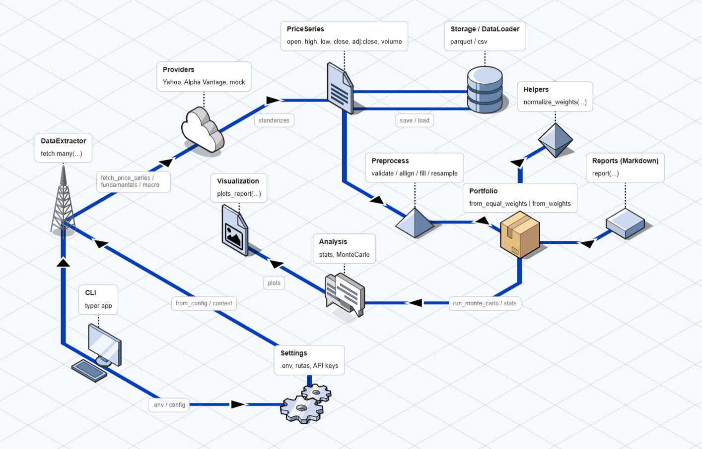

# Stock Toolkit

Stock Toolkit es un conjunto de herramientas plug-and-play para la obtención, normalización, análisis y visualización de datos bursátiles. El objetivo del proyecto es demostrar una arquitectura limpia y escalable que facilite la incorporación de nuevas fuentes de datos, modelos analíticos y flujos de trabajo reproducibles.

## Características principales

- **Extractor multi-fuente**: capa orquestadora que descarga datos históricos de acciones, índices y otras series temporales financieras desde proveedores configurables (Yahoo Finance, Alpha Vantage y proveedores personalizados).
- **Modelos tipados**: dataclasses `PriceSeries` y `Portfolio` que estandarizan la estructura de los datos, aplican estadísticos básicos automáticos y exponen métodos para análisis más profundos.
- **Simulación Monte Carlo**: generación de escenarios de evolución futura tanto a nivel de valor individual como de cartera completa, con parámetros ajustables.
- **Preprocesado y validación**: utilidades para limpiar, alinear y enriquecer series temporales antes de su análisis o almacenamiento.
- **Visualizaciones**: informes listos para usuario con gráficos clave y reportes en Markdown.
- **CLI con Typer**: interfaz de línea de comandos para ejecutar flujos típicos sin tocar código.

## Estructura del proyecto

```text
stock-toolkit/
├── README.md
├── LICENSE
├── pyproject.toml
├── requirements.txt
├── docs/
│   ├── architecture_diagram.png
│   └── usage_examples.md
├── data/
│   ├── raw/
│   ├── processed/
│   └── reports/
├── notebooks/
│   ├── exploratory_analysis.ipynb
│   └── montecarlo_demo.ipynb
├── src/
│   └── stock_toolkit/
│       ├── __init__.py
│       ├── cli.py
│       ├── main.py
│       ├── config.py
│       ├── constants.py
│       ├── data/
│       │   ├── __init__.py
│       │   ├── extractor.py
│       │   ├── providers/
│       │   │   ├── __init__.py
│       │   │   ├── yahoo.py
│       │   │   ├── alphavantage.py
│       │   │   └── other_provider.py
│       │   ├── loader.py
│       │   └── preprocess.py
│       ├── models/
│       │   ├── __init__.py
│       │   ├── price_series.py
│       │   └── portfolio.py
│       ├── analysis/
│       │   ├── __init__.py
│       │   ├── statistics.py
│       │   ├── montecarlo.py
│       │   └── reports.py
│       ├── visualization/
│       │   ├── __init__.py
│       │   └── plots.py
│       └── utils/
│           ├── __init__.py
│           ├── logger.py
│           └── helpers.py
└── tests/
    ├── test_extractor.py
    ├── test_price_series.py
    ├── test_portfolio.py
    └── test_montecarlo.py
```
## Diagrama del proyecto



## Requisitos

- Python 3.10 o superior.
- Claves de API opcionales (`ALPHAVANTAGE_API_KEY`) para proveedores que lo requieran.

Instalación rápida:

```bash
python -m venv .venv
. .venv/bin/activate  # En Windows: .venv\Scripts\activate
pip install -e .
# (opcional) extras de visualización con ajuste normal
pip install -e .[viz]
```

Para ejecutar la CLI:

```bash
stock-toolkit --help
```

## Flujo de trabajo recomendado

1. **Configurar proveedores** mediante variables de entorno o fichero `.env`.
2. **Descargar series** con `stock-toolkit fetch --provider yahoo --symbols AAPL,MSFT --start 2020-01-01 --end 2024-12-31`.
3. **Guardar o cargar** datos estandarizados con `loader.py`.
4. **Preprocesar** (limpieza, imputación, alineación) antes de análisis avanzados.
5. **Analizar** estadísticas descriptivas y riesgos con los métodos de `PriceSeries` y `Portfolio`.
6. **Simular** escenarios futuros con `stock-toolkit montecarlo ...` o `Portfolio.run_monte_carlo()`.
7. **Generar informes** en Markdown con `stock-toolkit report ...` y guardar gráficos con `--save-panel`.

## Configuración

El módulo `config.py` utiliza `pydantic-settings` para leer variables de entorno, ficheros `.env` y valores por defecto. Puedes definir la ruta de almacenamiento de datos (`STOCK_TOOLKIT_DATA_DIR`) y claves API:

```bash
export ALPHAVANTAGE_API_KEY="mi-clave"
export STOCK_TOOLKIT_DATA_DIR="/ruta/a/data"
export STOCK_TOOLKIT_MAX_WORKERS=8
```

Configuración rápida con `.env`:

Ejemplo de contenido para tu `.env` (créalo en la raíz del proyecto):

```dotenv
# Alpha Vantage API key (opcional, requerida para el proveedor alphavantage)
ALPHAVANTAGE_API_KEY=

# Carpeta base de datos (opcional)
STOCK_TOOLKIT_DATA_DIR=./data

# Proveedor por defecto (opcional: yahoo | alphavantage | mock)
STOCK_TOOLKIT_DEFAULT_PROVIDER=yahoo
```

Variables reconocidas:

- `ALPHAVANTAGE_API_KEY`: clave para Alpha Vantage.
- `STOCK_TOOLKIT_DATA_DIR`: carpeta base para datos.
- `STOCK_TOOLKIT_MAX_WORKERS`: límite de hilos para descargas concurrentes.

## Contrato de entrada de datos (PriceSeries)

Para garantizar coherencia entre proveedores y fuentes externas, el modelo `PriceSeries` exige:
- Índice: `DatetimeIndex` monotónico creciente, sin duplicados.
- Columnas requeridas: `open`, `high`, `low`, `close`, `adj_close`, `volume` (numéricas; precios no negativos).
- Las funciones de preprocesado (`validate_price_series`, `align_series`, `fill_missing`, `resample_series`) ayudan a adaptar datos externos.

Si deseas crear una `PriceSeries` manualmente:

```python
from stock_toolkit.models.price_series import PriceSeries
series = PriceSeries.from_dataframe("TICKER", df)
```

## CLI ampliada

Descarga de series (acciones o índices como `^GSPC`, `^IXIC`):

```bash
stock-toolkit fetch --provider yahoo --symbols AAPL,^GSPC --start 2020-01-01 --end 2024-12-31 \
  --max-workers 8 --output ./data/processed/prices.parquet
```

Reporte Markdown de cartera (pesos igualados si no se especifican):

```bash
stock-toolkit report --symbols AAPL,MSFT --provider yahoo --markdown-output ./data/reports/portfolio.md
```

Monte Carlo con guardado de panel y sin mostrar ventana gráfica:

```bash
stock-toolkit montecarlo --symbols AAPL,MSFT --provider yahoo --periods 252 --simulations 2000 \
  --save-panel ./data/reports/montecarlo_panel.png --no-show
```

Fundamentales (snapshot) y macro (serie temporal):

```bash
stock-toolkit fundamentals --symbol AAPL --provider alphavantage --output ./data/processed/aapl_funda.parquet
stock-toolkit macro --indicator CPI --provider alphavantage --output ./data/processed/cpi.parquet
```

## Extensibilidad

- Añade un nuevo proveedor implementando la interfaz `BaseProvider` y registrándolo en tiempo de ejecución con `DataExtractor.register_provider(...)` o extendiendo la fábrica `data.providers.create_default_providers(...)`.
- Los modelos son dataclasses que facilitan la validación y los cálculos derivados.
- Los módulos de análisis y visualización están desacoplados para permitir sustituir librerías (por ejemplo Plotly o Altair).

Políticas relevantes de datos y cartera:

- Retornos: Monte Carlo utiliza retornos logarítmicos. Las métricas de cartera permiten elegir tipo (`return_type="simple"|"log"`) y por defecto usan retornos logarítmicos.
- Frecuencia: cada símbolo debe ser único en la cartera. Si necesitas la misma serie a otra frecuencia, resamplea antes de añadirla.

## Documentación y diagramas

- El diagrama de arquitectura en `docs/architecture_diagram.png` se crea con FossFLOW y la imagen se actualiza manualmente en este repositorio.
- FossFLOW es una potente PWA open‑source para crear diagramas isométricos. Construida con React y la librería Isoflow (bifurcada y publicada en NPM como `fossflow`), funciona completamente en el navegador con soporte offline.

## Licencia

Este proyecto está distribuido bajo la licencia MIT. Consulta el fichero `LICENSE` para más detalles.

